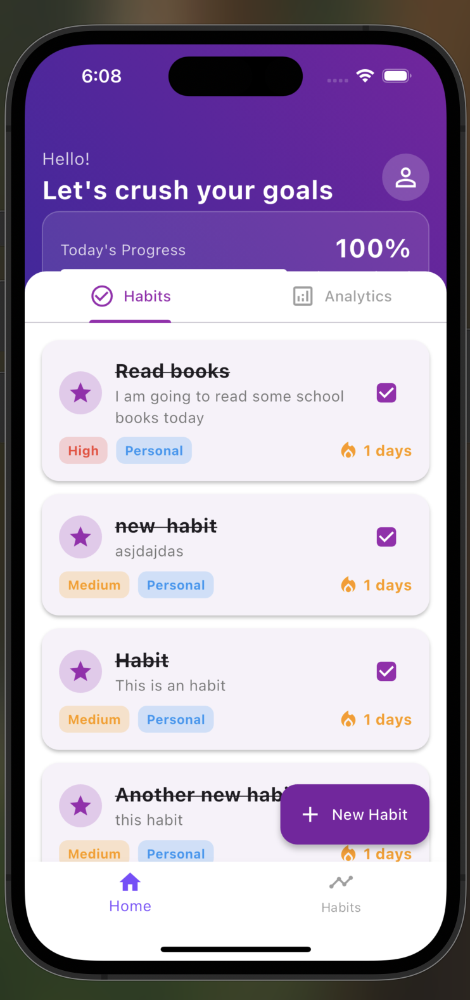
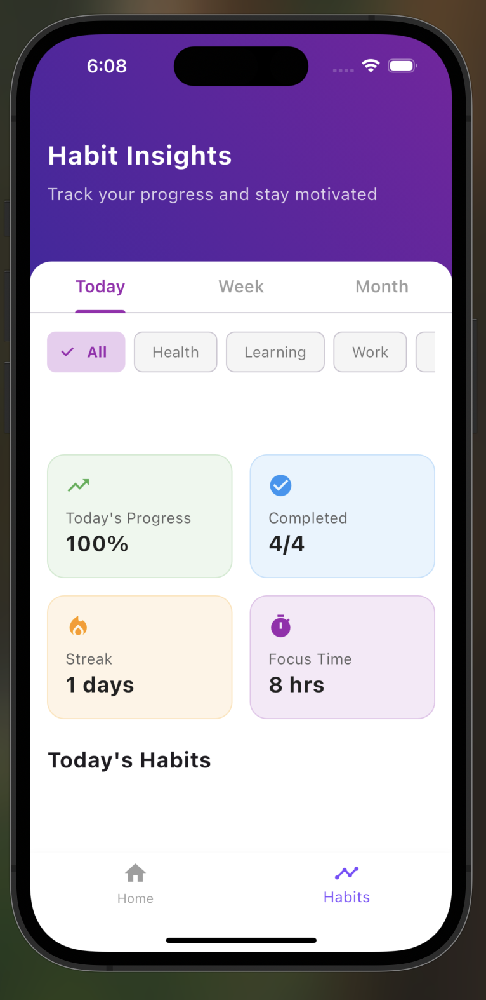
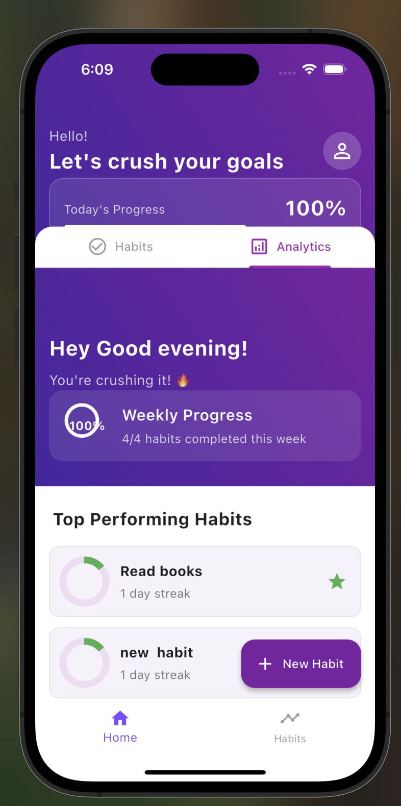
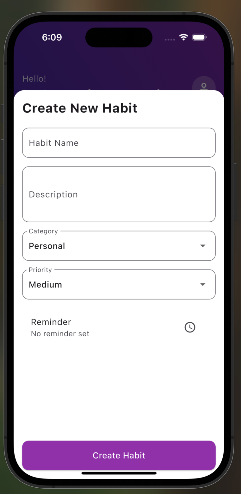
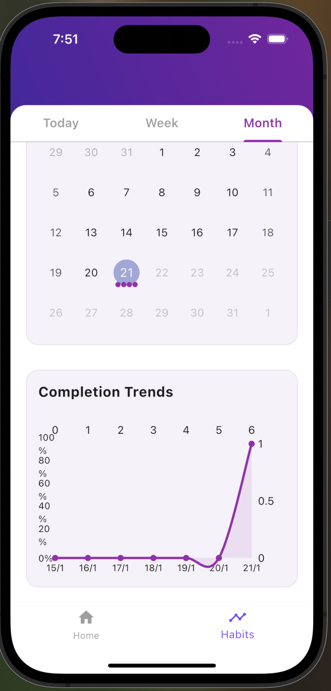

# Routinely - Habit Tracking App

Routinely is a modern, feature-rich habit tracking application built with Flutter that helps users build and maintain positive habits through intuitive tracking, insightful analytics, and motivational features.

## Screenshots

  

    
    
    
  

### Daily View & Tracking

  

    
  

### Analytics & Insights

  

   
  

## Features

### 1. Habit Management
- Create and customize habits with:
  - Name and description
  - Category (Health, Work, Learning, Personal)
  - Priority levels
  - Custom reminders
  - Flexible scheduling

### 2. Tracking & Progress
- Mark habits as complete
- Track daily streaks
- View completion history
- Monitor time-based patterns
- Calendar view with completion markers

### 3. Analytics & Insights
- Detailed habit statistics
- Category breakdown
- Completion trends
- Time distribution analysis
- Success rate tracking
- Best performing habits

### 4. User Interface
- Clean, modern design
- Intuitive navigation
- Category filtering
- Progress visualization
- Interactive charts
- Responsive layout

## Usage

### Creating a Habit
1. Tap the '+' button
2. Enter habit details:
   - Name
   - Description
   - Category
   - Priority
   - Reminder time
3. Save the habit

### Tracking Habits
- Mark habits complete by tapping the checkbox
- View streaks and progress in the analytics tab
- Filter habits by category
- Check upcoming habits in the daily view

### Viewing Analytics
- Access detailed insights in the Habits page
- View daily, weekly, and monthly trends
- Track completion rates and patterns
- Monitor category distribution